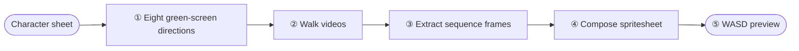
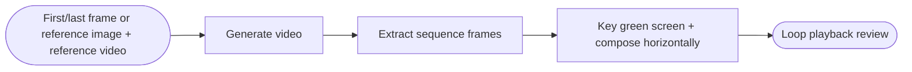

English | [中文](https://github.com/universe-st/dsh-game-material-master/blob/main/README.md)

# Game Material Master

**Start from a single character sheet and batch-produce the assets your game actually needs.**

Volcengine Ark **Seedream** handles image generation, **MiniMax** handles image-to-video, and keying,
frame extraction, pixel quantization and spritesheet composition all happen locally through `ffmpeg` —
no system image libraries required, and your assets are never uploaded to a third-party service.

[](https://www.npmjs.com/package/dsh-game-material-master)
[](LICENSE)


> **Up and running in 30 seconds**: `dsh plugin --profile web add dsh-game-material-master` → restart DSH →
> click "Game Material Master" in the sidebar → enter the two API keys in settings → create a project,
> upload your character sheet → click "Generate turn video" (the default path: the character rotates steadily
> in place for one full turn, then the eight directions are cut out automatically; switch the method in
> stage ① if you'd rather generate each direction separately).

All four modules share the same "generate → review → re-run" workbench. Every stage can be **redone on its
own**, and every asset can be **approved item by item**. The "review mode" lets an agent approve each step
and move on automatically, or stop at every step and wait for your go-ahead.

| Module | What it does | What you get |
|---|---|---|
| **① Eight-direction sprite sheet** | One character sheet → 8 directions × 8 frames (default "turn capture": eight directions cut from one rotation video) | A walk spritesheet you can drive with WASD |
| **② Image generation** | Prompt (optionally with reference images) → images → green-screen keying | Clean transparent PNG character art / props |
| **③ Sequence frames** | First/last frame or a reference video → generate video → extract frames → key | A horizontally laid out, loopable sequence |
| **⑤ Map tile generation** | Isometric tiles → assemble a whole map | A tile pack (PNGs) + map PNG + layout JSON |
| ~~④ Rigged animation~~ | Part extraction → assembly → skeletal animation → Spine / DragonBones atlas | **Experimental, not covered in this document** |

> 💡 **Module ⑤ "Map tile generation" is built on one idea: geometry by code, content by AI.**
> The diamond template is rendered locally (strict 2:1 isometric) and the AI only fills its interior with the
> requested terrain. Each result is then measured and affine-aligned back to the standard diamond, and the map
> is assembled locally on the isometric grid. Geometry is therefore always exact — tiles never show seams, and
> re-assembling with the same seed is pixel-identical. Measured: letting the model draw the diamond freely
> gives ratios of 1.03–1.55 (nowhere near 2:1), while template filling hits 100%.

> ⚠️ **Module ④ "Rigged animation" is still experimental and not yet finished**: the quality of part extraction
> depends on the image model, automatic assembly and bone inference frequently need manual correction on real
> character art (agent visual priors or manual dragging), and the exported Spine / DragonBones output has not
> seen enough engine-side validation. The module carries an "experimental" badge in the UI and shows a dialog
> every time you enter it. This document only covers the first three modules.
> If you need it — or want to help make it solid — you're welcome to join in at the
> [GitHub repository](https://github.com/universe-st/dsh-game-material-master).

---

## ① Eight-direction sprite sheet

Feed in one front-facing character sheet and get all eight directions in one pass:
**green-screen images → walk videos → sequence frames → final spritesheet → interactive preview**.



### The two generation methods: turn capture (default) / per-direction generation

There are two ways to produce the eight direction images, and the output is identical either way
(`images/<direction>.png`), so the next four steps don't change:

| | **Turn capture (default)** | Per-direction generation (alternative) |
|---|---|---|
| How | Generate **one** green-screen video of the character turning steadily in place for a full rotation, then cut frames for the eight directions along the timeline | Generate each of the eight directions separately, in dependency order |
| Cost | One video call | Eight image calls |
| Consistency | **All eight directions share one source**: same character, same lighting, same art style | The model has to re-interpret the character every time, so face shape, hair color and clothing tend to drift |
| Adjusting position | The timeline has **eight draggable circles** — drag to a frame and that frame is cut (re-cut locally, free and instant) | Regenerate each image |

The row of circles in the UI is the capture position for each of the eight directions, and the thumbnail
strip below it is the candidate frames for the whole rotation — drag against the picture and release to
re-cut that one image (this also invalidates that direction's walk video and sequence frames automatically,
so old and new orientations never get mixed together). The default positions assume an even split
"starting from the front, one full rotation at constant speed"; when the model actually turns in a different
direction or at a different pace, just drag the circles, or click "turn direction" to re-order them. Changing
the candidate frame count (8–64) re-extracts automatically and rescales any positions you have dragged.

### How to use it

1. **Create a project → upload a character sheet**, then write your prompts (turn capture uses **one turn-video
   prompt**; per-direction generation uses one prompt per direction, plus a shared "common suffix prompt" for
   all eight).
2. **Generate turn video** (the default path): the character rotates steadily in place for one full turn
   against a green screen. Once the video arrives, the plugin extracts candidate frames and cuts out the eight
   directions automatically — you usually don't need to touch anything. **Per-direction generation** (the
   alternative) is **generate all in one click**: the eight directions produce green-screen full-body images in
   dependency order. Per image you can see the elapsed time and which model was used; if you don't like one,
   **regenerate** that image, or expand **edit prompt** to change just that one.
3. **Generate all videos**: make the character walk three steps in place in each direction. This is the most
   expensive and slowest step (1–6 minutes per clip).
4. **Extract all sequence frames**: each video is sampled evenly across its duration; uniform cropping, scaling
   and **pixel-art quantization** all happen here too.
5. **Compose spritesheet**: remove the green screen and stitch the rows into one spritesheet; drag rows with
   ↑↓ to reorder, and you can save parameters before composing.
6. **Walk preview**: drive the character with WASD or the arrow keys — whether the eight directions blend
   smoothly is obvious at a glance.

### ① Eight green-screen directions

**Turn capture (default)**: one green-screen video of "a steady full rotation in place", cut into eight
directions along the timeline; the eight circles on the axis are their capture positions — drag to change
them and release to re-cut instantly (locally, free).


**Per-direction generation (alternative)**: each of the eight directions is generated separately; single
images are sharper, which suits cases where you only need a few directions or want maximum per-image quality.


### ② Walk videos


### ③ Extract sequence frames


### ④ Key green screen and compose spritesheet


### ⑤ Walk preview


> **Re-running a single step**: if any step isn't right, redo just that step — a single direction or a single
> stage — instead of starting the whole batch over.

---

## ② Image generation

Generate images from a prompt, with optional reference images. After generation the green screen is
**keyed automatically** into a transparent PNG — or you can upload an existing image and run only the keying,
without spending anything on generation.

### How to use it

1. Write the main prompt; put requirements you reuse across batches (for example "no text watermarks") into the
   **common suffix prompt**.
2. Optional: drop in **reference images** (up to 10); with references present, it runs image-to-image. To cite
   several of them, refer to "image one", "image two" in the prompt.
3. Pick the model / size / count and click **Generate**.
4. In the results area, review **image by image**: approve, download the PNG, regenerate, delete. The background
   percentage is shown right there so you can judge how clean the keying is.


---

## ③ Sequence frames

A more "one shot" path than the eight-direction sheet: give it a first-frame image (or a reference image plus a
reference video) and it generates a looping motion directly, then extracts frames, keys them, composes them
horizontally and **plays the loop in place for preview**.



### How to use it

1. Pick a mode — the platform makes the two mutually exclusive:
   - **First/last frame mode**: one image as the starting frame (the last frame is optional);
   - **Multimodal reference mode**: reference image + reference video, used to constrain style and motion.
2. Write a prompt, pick the model / duration (4–15 seconds) / resolution, and click **Generate video**.
3. **Extract sequence frames**: frame extraction, uniform cropping, pixel quantization.
4. **Green-screen keying and composition**: tune the keying parameters and compose the horizontal strip; the
   preview area on the right plays it back in a loop at the frame rate — **whether the motion flows and whether
   the keyed edges stay stable is immediately visible in playback**.
5. **Review**: approve each of the three steps.


---

## Driving it from chat

**Every feature of all four modules** (including the experimental rigged animation) **is available through
chat**. The plugin registers the whole pipeline as `game_material_*` tools, so an agent can drive it forward,
wait, review, and also stop at each step for you to approve.

| Tool | What it does |
|---|---|
| `game_material_intake` | **Step 0 of the fixed workflow**: nail down the key parameters and review mode before doing anything |
| `game_material_call` | Universal channel: every remote method of the plugin is individually callable, covering all features |
| `game_material_upload` | Upload assets by local file path (character sheet / reference image / first and last frames / parts…) |
| `game_material_reviewMode` | Record the review mode: `auto` approves automatically / `manual` requires human approval at each step |
| `game_material_status` | See the current progress and which step to do now |
| `game_material_wait` | Block until "no task is running"; what comes back is a reviewable state |
| `game_material_review` | Produce a **review package**: absolute URL, status, approval flag and deep link for every asset |
| `game_material_approve` | Approve / un-approve |

Review links are **deep links**: an `openUrl` posted by the agent in its reply takes you straight to the
matching plugin page when clicked, landing on the right module / project / stage without any navigating
on your part.

---

## Installation

```bash
# install from npm
dsh plugin --profile web add dsh-game-material-master

# install from a local directory (during development)
dsh plugin --profile web add /path/to/dsh-game-material-master
```

The package is published to npm: [dsh-game-material-master](https://www.npmjs.com/package/dsh-game-material-master)
(currently `0.1.1`, `latest`). It has no runtime dependencies, so `dsh plugin add` is all you need.

After installing, **restart DSH** (the host half is loaded at startup). The browser half is read from
`lib/client.js` on disk on each request, so refreshing the browser is enough for it to take effect.

**Dependencies**: `ffmpeg` / `ffprobe` must be on your `PATH` (macOS: `brew install ffmpeg`), or you can
point `FFMPEG_PATH` / `FFPROBE_PATH` at absolute paths. The package has **no runtime npm dependencies** —
`zod`, `cordis` and friends all resolve from DSH's own installation tree.

> When upgrading from the older `dsh-8dir-sprites`, the first startup migrates the data directory
> automatically and your existing projects carry over seamlessly.

## Configuration

**Settings → Game Material Master**:


| Item | Description |
|---|---|
| Volcengine Ark API Key | "Test connection" really generates a 1K thumbnail (a small charge) and validates both the key and the model |
| Image model | Defaults to `doubao-seedream-4-0-250828`; switchable to 4.5 / 5.0 Lite / Pro |
| MiniMax API Key | "Test connection" is free and can tell an invalid key apart from other errors |
| Video model | Defaults to `MiniMax-H3` (v2 protocol); Hailuo / I2V use v1; the UCloud version of H3 is selected explicitly |
| Base URL | Host root, without `/v1` or `/v2`. `api.minimax.cn` in mainland China, `api.minimaxi.com` internationally |
| Default parameters | Cell width and height, frame count, pixel block size, keying threshold, and so on |

Keys are written only to `<DSH_HOME>/game-material-master/config.json` on your machine, and the UI always
masks them when displaying them back. **The model is a plugin-level setting shared by all three modules**;
after you switch models, tasks align to the new tier automatically.

## UI language

**The plugin UI follows DSH's own language setting** (Settings → General → Language). Chinese and English are
both first-class, and switching takes effect **immediately** with no page refresh: the workbench title, the four
module tabs, every card's buttons, notice bars, dialogs and the settings page all follow along.

Implementation-wise it neither guesses nor copies DSH's language state; instead it hooks into DSH's `locale`
service (`@deepseek-ai/dsh-client-locale`): the plugin registers its Chinese/English string table there and
afterwards pulls every piece of UI text from it. If the service isn't there, nothing errors and the UI falls
back to the original Chinese.

**The built-in default prompts switch too.** The eight-direction image prompts, walk-video prompts and
turn-video prompts have English versions when the UI is in English — they really do get sent to
Seedream / MiniMax, so the language has to match the UI, otherwise you can't tell what you're tuning. The rule
is "only swap the ones you haven't edited": prompts you have edited by hand don't change a single character when
you switch languages, and "Reset to default" gives you the default for the **current** language. Prompts live on
the host side (the host has no access to the locale service), so the browser half passes the current language
along every time it reads a project or resets prompts.

Scope note: **localization covers the browser half's UI text and the built-in default prompts** — the workbench
title, the four module tabs, every card's buttons and notice bars, dialogs, the settings page, the review
controls, and the default prompts. Two categories remain in Chinese, because DSH currently only exposes the
locale service to the browser half:

- **Lines the host writes into the run log** (the host emits Chinese, so they actually look like
  `开始生成「南 · 正对镜头」`, `「南 · 正对镜头」生成完成，用时 12.3 秒`) plus the dynamic conclusions from
  part-extraction QA;
- Text that chat tools return for the model to read (the rendering of `game_material_status` / `review`, the
  follow-up questions from `intake`).

Everything in the UI that you can click, change or approve is bilingual.

## Common pitfalls

- Don't use "silhouette" in a prompt — the image model takes it literally and paints the character as a solid
  black outline.
- Distinguish "turning" from "gaze": when writing a direction, add "rotate around the vertical axis only, gaze
  stays level", or the character ends up looking up at the sky.
- Image-to-video doesn't guarantee it will preserve a flat background (lighting can turn it into a gradient), so
  the keying doesn't rely on a single green value.
- Duplicate submissions are blocked (both in the UI and in chat) so you don't burn money for nothing.

## Where the output goes

```
<DSH_HOME>/game-material-master/
├── projects/<id>/      eight-direction sheet (source / images / videos / frames / keyed / preview / out)
├── image-jobs/<id>/    image generation
├── sequence-jobs/<id>/ sequence frames
└── rig-jobs/<id>/      rigged animation (experimental: sheet / parts / layout / rig / atlas)
└── tile-jobs/<id>/     map tiles (template / raw / cell / decor / map / export)
```

> Map tiles keep the **raw generation output** in `raw/`: after changing regularisation parameters such as
> the cell size you can re-run regularisation for free, without paying to generate again.

## Development

```bash
npm run build        # tsc → lib/, and strip the trailing export from the browser bundle
npm run typecheck    # type checking only
```

Local self-checks (no network, no cost): `scripts/verify-host.mjs` (host pipeline), `verify-tools.mjs`
(chat-facing tool surface), `verify-pipeline.mjs` (frame extraction / keying / composition), `verify-client.mjs`
+ `verify-feedback.mjs` (browser-half contracts and real rendering), `verify-i18n.mjs` (Chinese/English string
table completeness), `verify-rig.mjs` (the rigging algorithm layer), and more. End-to-end scripts that hit the
real API cost money — run them only when you mean to.

### Adding a piece of UI text

The **Chinese source text you write is itself the key** in the string table, so you just write code
normally (yes, the key stays Chinese even in the English build — that is the point: the call site reads
as the copy, and a missing translation falls back to the key instead of showing a code name):

```ts
h("span", null, T("正在装配定位…"))                       // plain copy
T("第 {n0} 帧", { n0: index + 1 })                        // with interpolation; English may reorder freely
```

Then add an English entry to the string table in `src/client.ts` (between `i18n-ignore-start` /
`i18n-ignore-end`); if you miss one nothing crashes, but `verify-i18n.mjs` will catch it. To wrap legacy code
in bulk, use `node scripts/i18n-wrap.mjs src/client.ts --write` (lexical, idempotent, safe to run repeatedly).

How changes take effect after you edit code:

| What you changed | How it takes effect |
|---|---|
| `src/client.ts` (browser half) | Just refresh the browser |
| `src/*.ts` host half | Restart DSH (or hot-reload with `--patch`) |

The screenshots in this document were taken by Playwright against the real UI; the originals live in
[`docs/images/`](https://github.com/universe-st/dsh-game-material-master/tree/main/docs/images).

## Known trade-offs

- **The pixel-art look comes from post-processing** (pixel quantization during frame extraction), not from the
  prompt — Seedream ignores "pixel art"-style instructions.
- **Part-extraction quality is determined by the image model** and is the biggest bottleneck right now. The
  model occasionally "swaps the character" or splits them into clothing pieces; the most reliable path is
  "upload your own part PNGs" (the filename is the part name), which skips generation entirely.
- **Automatic assembly is only reliable when each part really is a whole limb from the reference image**; when
  real character art goes through generated part extraction, prefer correcting it with agent visual priors or
  manual dragging (neither of those steps costs anything).
- MiniMax occasionally rejects content on moderation (about 10% in practice); just reword to a more neutral
  prompt and retry.

## License

[MIT](LICENSE)

> Full engineering documentation (algorithm details, self-check contracts, history of pitfalls) is in
> [docs/ENGINEERING.md](docs/ENGINEERING.md).
