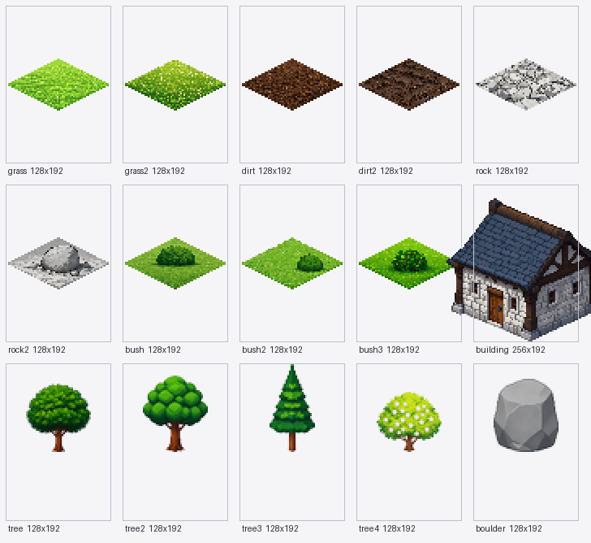
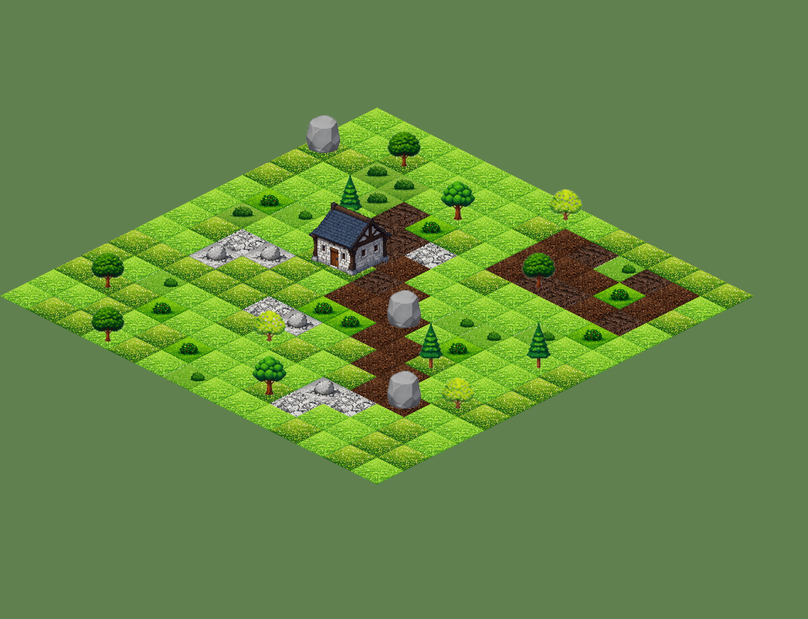
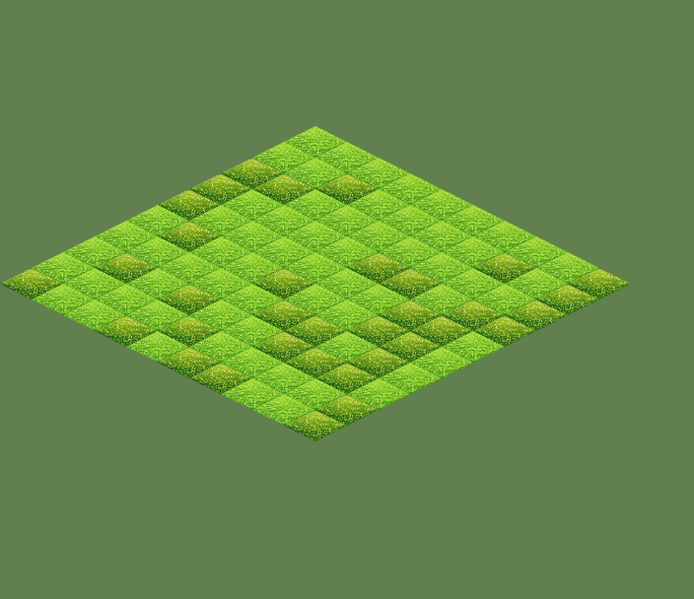
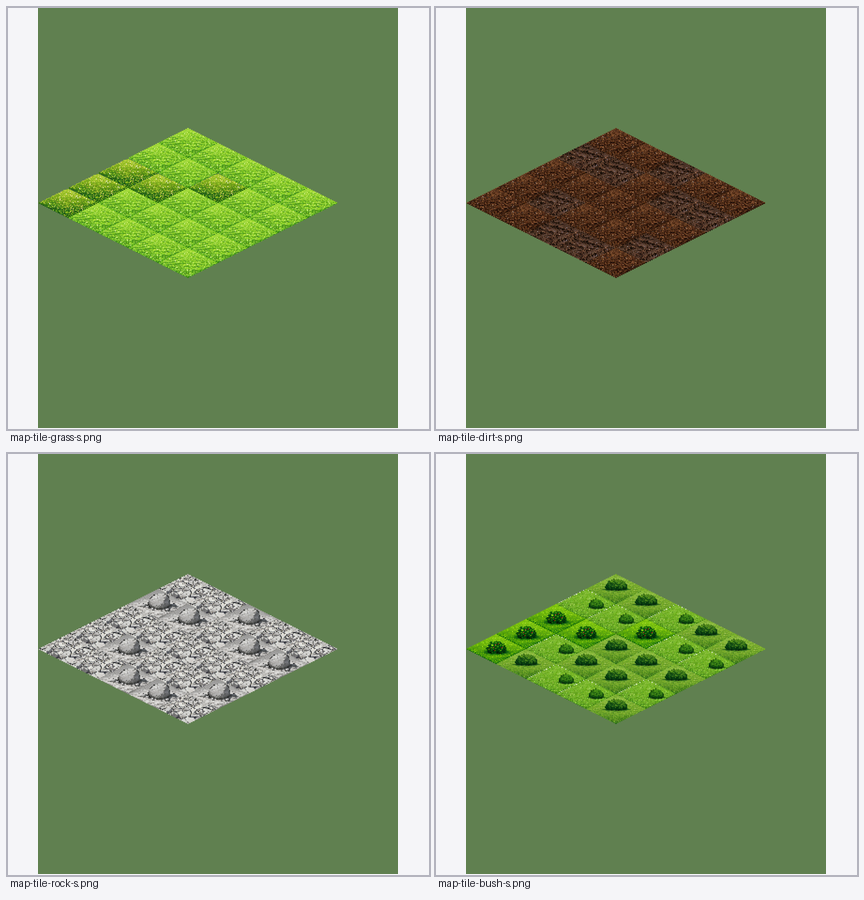
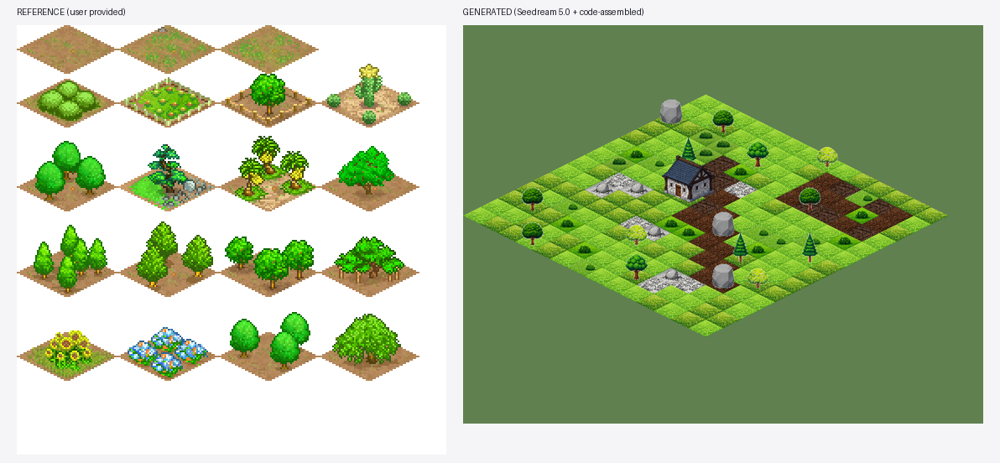
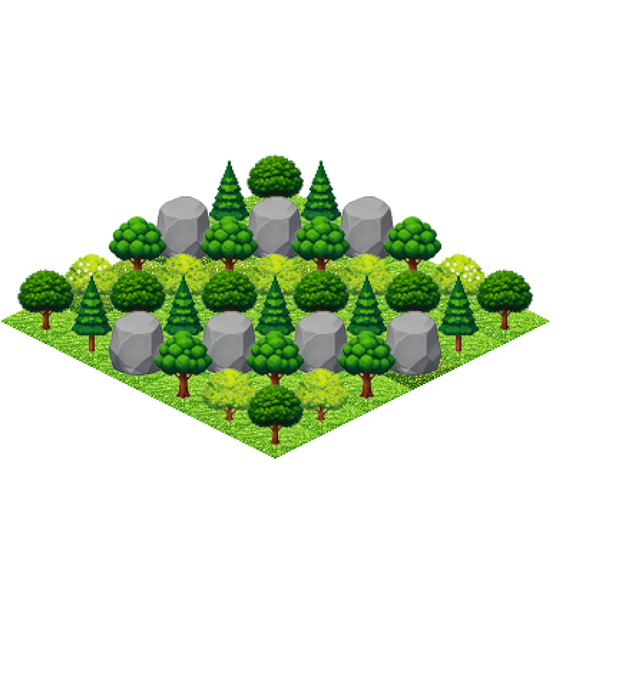
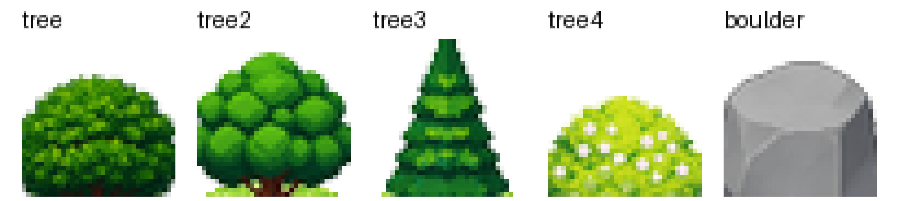

# 让 AI 稳定生成 45° 俯视地图地块 —— 调研与实验报告

> 目标：像 [`b28436693ce40fc5e9e0c415783f278b47292ef3.png`](file:///C:/Users/kuang/Desktop/b28436693ce40fc5e9e0c415783f278b47292ef3.png)（用户给的参考图）那样，
> 稳定产出 **斜 45° 等轴测（2:1 菱形）** 的地图地块：草地、土地、石块、大型建筑（跨格）、灌木，
> 并且能把它们**无缝拼成一张地图**。
>
> 结论先说：**能，而且很稳。但「稳」不是靠提示词，是靠「几何交给代码、内容交给 AI」的分工。**
> 纯文生图（哪怕把 2:1、26.565° 一个字一个字写进提示词）实测菱形比例误差 **25%~49%，没有一次达标**；
> 换成「代码画精确菱形模板 → AI 只填内部内容」后，13 张随机样本比例 **1.987~2.010（平均 1.9994）、100% 落在 ±0.05 内、最大相对误差 0.63%**。

---

## 目录

- [一、参考图到底在说什么（几何基准）](#一参考图到底在说什么几何基准)
- [二、实验设计](#二实验设计)
- [三、四条路线的实测结果](#三四条路线的实测结果)
- [四、为什么提示词路线必输（机制解释）](#四为什么提示词路线必输机制解释)
- [五、因子拆解实验（模型 / 底色 / mask / 透明）](#五因子拆解实验模型--底色--mask--透明)
- [六、推荐的量产流程](#六推荐的量产流程)
- [七、成品：5 类地块 + 组合地图](#七成品5-类地块--组合地图)
- [八、树怎么做（高出菱形的装饰）](#八树怎么做高出菱形的装饰)
- [九、接进插件「游戏素材大师」的落地方案](#九接进插件游戏素材大师的落地方案)
- [十、成本与耗时](#十成本与耗时)
- [十一、踩过的坑清单](#十一踩过的坑清单)
- [十二、尚未解决 / 可继续做的事](#十二尚未解决--可继续做的事)
- [附录 A：可直接复用的提示词原文](#附录-a可直接复用的提示词原文)
- [附录 B：研究脚本清单](#附录-b研究脚本清单)

---

## 一、参考图到底在说什么（几何基准）

参考图 256×256，实际是 **4×4 个 64×64 的单元格**（不是 4×5——这块早期数错过一次，
用扫描线重新数：菱形上顶点的 y 依次出现在 0 / 64 / 128 / 192 这 4 行）。
每个单元格里有一个菱形底座 + 上方立体装饰。逐像素量出来的关键数字：

| 量 | 实测值 | 换算 |
|---|---|---|
| 单元格 | 64 × 64 px | — |
| 菱形底座宽 | 60 px（x 从第 2 列到第 61 列） | — |
| 菱形底座高 | 30 px（y 从第 0 行到第 29 行） | 宽:高 = **2.0** |
| 菱形上顶点 | 单元格内约 (29.5, 0) | 略偏左上 |
| 网格步进 | 相邻格 (±30, +15) | 正好半宽/半高 → **边对边无缝** |
| 每格留白 | 菱形以下约 34 px | 给「上方装饰」和「下一行地块」预留 |

两个关键推论，后面全部流程都建立在这上面：

1. **这是标准 2:1 等距（isometric），不是透视俯视。** 菱形对角线比恰好 2.0，斜边倾角 26.565°。
2. **一个单元格里，菱形只占上半部分，剩下的是「下一行地块的显示空间」。**
   所以「地块贴图」和「网格」是两套坐标：贴图是 64×64，网格步进是 (±32, +16)。
   直接把 64×64 按 64 像素步进铺，会漏出缝（我们第一次拼图就是这么错的，见§十一坑 3）。
   > 注：最终交付**没有照抄这个 64×64**，而是把单元格加高到 **64×96**
   > （菱形仍在 y∈[32,64]，上方多留 32px 给高出地面的装饰）。地面上完全等价，
   > 但装饰可以往画面外长。见 §八。

> 附注：参考图本身也是 AI 生成的（有轻微抖动、步进不完全一致）。我们**没有去复刻它的抖动**，
> 而是把几何收敛到数学精确的 2:1。参考图的实际比例是 2.0，说明它本来就是按 2:1 生成的，
> 抖动只是生成噪声。

---

## 二、实验设计

### 被比较的四条路线

| 代号 | 路线 | 做法 |
|---|---|---|
| ① | **纯文生图** | 只给文字（中/英各一版），强调 "2:1 等距菱形 / 正交投影 / 26.565° / 无侧壁" |
| ② | **纯文生图 + 长约束** | 再加一小节《必须严格遵守的画面规格》，把 2:1 换算成像素例子、把四条边斜率写出来 |
| ③ | **参考图引导的自由生成** | 把参考图（或参考图切出的单块、白底版）作为 `image` 输入 + 文字 |
| ④ | **模板填充** | **代码**先画一张精确的 2:1 洋红菱形 PNG → 作为 `image` 输入，提示词只描述「菱形里面该是什么」，并反复强调「轮廓不许动」 |

### 量化指标（怎么判「稳不稳」）

写了 [`geo.py`](tools/geo.py) 自动量每张产出：

- **iso_ratio**：`dx/dy`，地面菱形下边每往下 1 px 横向外扩多少 px。**理想 = 2.000**
  （等价于宽高比 2:1、斜边倾角 26.565°）
- **edge_resid**：菱形两条下边的像素点到拟合直线的最大偏差（px）。越大说明边越不平直/有装饰干扰
- **可达性**：`|iso_ratio - 2| ≤ 0.05` 记为达标

> 为什么不直接量包围盒：装饰（树、灌木、建筑）会超过菱形边界，包围盒会把装饰算进去。
> 所以只量**下半部分的两条下边**（装饰一般在上方），斜率就是等距比例。

---

## 三、四条路线的实测结果

统计脚本：[`stats.py`](tools/stats.py)（只统计拟合残差 < 12 px 的可信样本）

| 方法 | 样本 | iso_ratio 范围 | 平均 | 平均绝对偏差 | 达标率 |
|---|---|---|---|---|---|
| ① 纯文生图 Seedream 4.0 | 3 | 1.682 ~ 1.917 | 1.726 | 0.274 | **0%** |
| ② 纯文生图 5.0 + 长几何约束 | 5 | **1.029 ~ 1.554** | 1.252 | 0.748 | **0%** |
| ③ 参考图引导的自由生成 | 1 | 1.412 | 1.412 | 0.588 | **0%** |
| ④ **模板填充 5.0（三档模型）** | 13 | **1.987 ~ 2.010** | **1.9994** | **0.0055** | **100%** |

模板填充逐条（`research/probe/b8/`）：

| 文件 | 模型 | ratio | 倾角 | 边残差 | 相对误差 |
|---|---|---|---|---|---|
| G-grass-pro | 5.0 Pro | 2.0000 | 26.57° | 0.0 px | 0.00% |
| G-grass-lite | 5.0 Lite | 2.0000 | 26.56° | 3.1 px | 0.00% |
| G-grass-flash | 5.0 Flash | 2.0065 | 26.49° | 1.1 px | 0.32% |
| G-dirt-flash | 5.0 Flash | 2.0057 | 26.50° | 1.6 px | 0.29% |
| G-dirt-lite | 5.0 Lite | 1.9874 | 26.71° | 4.9 px | 0.63% |
| G-rock-pro | 5.0 Pro | 2.0036 | 26.52° | 1.5 px | 0.18% |
| G-rock-flash | 5.0 Flash | 1.9927 | 26.65° | 1.6 px | 0.37% |
| G-rock-lite | 5.0 Lite | 1.9962 | 26.60° | 3.6 px | 0.19% |
| G-bush-flash | 5.0 Flash | 1.9963 | 26.61° | 1.0 px | 0.19% |
| G-bush-lite | 5.0 Lite | 1.9925 | 26.65° | 3.6 px | 0.38% |
| G-bushmany-flash | 5.0 Flash | 2.0104 | 26.45° | 1.0 px | 0.52% |
| G-tree-flash | 5.0 Flash | 2.0057 | 26.50° | 0.9 px | 0.29% |
| G-tree-lite | 5.0 Lite | 1.9950 | 26.62° | 2.7 px | 0.25% |
| **汇总** | | | **26.57°**（理想 26.565°） | | **max 0.63% / mean 0.28%** |

> 被剔除的 3 个样本是「装饰把地面边挡住导致测量失效」，不是生成失败：
> `G-tree-pro`（树太靠前）、`G-bushmany-lite`（四丛灌木盖住下边）、`G-building-flash`（建筑直接压在地基上）。
> 这三张按模板几何裁切后依然是精确的 2:1 —— 模板填充的本质就是「几何不依赖测量」。

### 一个反直觉的发现

**提示词越"认真"，结果越差。**

- 中文短提示（"2:1 等距菱形…"）：ratio 1.917
- 英文短提示：ratio 1.682
- 参考图 + 提示词：ratio 1.726
- ② 的**长约束提示词**（400+ 字，写明 26.565°、宽高比 2.0、像素例子）：ratio 掉到 **1.029~1.554**

原因见下一节。这条直接决定了插件里**不要**走「堆提示词」的路线。

---

## 四、为什么提示词路线必输（机制解释）

1. **扩散模型没有「角度」这个连续可控量。**
   它是在像素分布上采样。文字里的 "2:1" "26.565°" 只是把它往「看起来像等距」的区域推，
   落点是分布里的某个样本，不是解方程的结果。所以比例在 1.0~1.9 之间随机漂移。

2. **约束越多，越像「风格描述」而不是「几何约束」。**
   把 "26.565°" "宽 1000px 时高 500px" 这类内容写进去，模型把它们当成「这是张技术插画」的线索，
   反而更爱画成立体的、带透视的、有厚度的东西 —— 实测这一版的比值最差（1.03~1.55）。

3. **参考图会同时传递「画风」和「画错的几何」。**
   参考图里的菱形有抖动，模型学到的是「大概这样」，不是精确 2:1。
   而且参考图是 4×4 拼好的大图，模型容易理解成「画一整片地面」而不是「画一格」。

4. **「不要侧壁 / 不要厚度」是负向约束，对扩散模型效果很弱。**
   实测几乎每张自由生成都会画出一层深色的侧面（[`A1-geom-cn.jpg`](probe/b1/A1-geom-cn.jpg) 最明显），
   拼图时这层侧面会盖住邻格，直接破坏无缝性。

> **所以真正的杠杆不在提示词，在「谁负责画轮廓」。**
> 只要轮廓不是模型画的，它就一定对；模型只需要把颜色和纹理填进给定区域 —— 这是它最擅长的事。

---

## 五、因子拆解实验（模型 / 底色 / mask / 透明）

### 5.1 模型可用性与透明输出（`research/probe/b7/`）

| 模型 | 可用 | `background:"transparent"` | 输出 |
|---|---|---|---|
| doubao-seedream-4-0-250828 | ✅ | 不支持 | JPEG，**无 alpha**（会在图上脑补"透明棋盘格"） |
| doubao-seedream-4-5-251128 | ❌ 404 无权限 | — | — |
| doubao-seedream-5-0-260128（Lite） | ✅ | **不稳定**：同样请求有时 RGBA、有时退化成 RGB | PNG |
| doubao-seedream-5-0-flash-260915 | ✅ | **稳定 RGBA** | PNG |
| doubao-seedream-5-0-pro-260628 | ✅ | **稳定 RGBA** | PNG |

> 实测 Lite 版本对同一份 `background:"transparent"` 请求会时好时坏（b6 的 M1/M2 拿到 RGBA，M3/M5 拿到 RGB）。
> **量产请固定用 `flash` 或 `pro`。**

### 5.2 模板底色（`research/probe/b6/`）

给 AI 的模板底色决定了它「留不留边」：

| 模板底色 | 结果 |
|---|---|
| **洋红 255,0,255** | 比例最准（2.009~2.020），但约 1/3 的样本会在菱形边沿**残留一圈洋红**（[`G-bushmany-flash`](probe/b8/G-bushmany-flash.png) 能看到） |
| 中性灰 150,150,150 | 比例同样准（1.999），残留概率更低，但模型有时把它当成"石板地面"背景 |
| 深棕 165,130,90 | 比例准（2.023），残留少 |
| **纯白底 + 洋红菱形** | 比例准（2.015），但模型会把白底也当"地面"往外扩 |

**结论**：洋红最"异类"、最容易被模型完全覆盖，配一句「请把洋红色外框完全去掉」+ 后处理裁剪即可。
残留的洋红像素在 `prepare.py` 里也会被当作"模板残留色"剔除。

### 5.3 `mask` 参数

Seedream 5.0 接受 `mask`（白=重绘、黑=保留）。实测**有效但不必要**：
走模板填充时，几何已经由模板 + 后处理裁剪双保险锁死，mask 只是多一层保险。
（`research/probe/b6/M1/M5` 有 mask 与无 mask 的结果几何一致。）

### 5.4 「一张图出多个地块」 vs 「一张图一个地块」

❌ **失败**。让模型在 2×2 网格里各画一种地形的实验（[`T4-sheet2x2-lite.png`](probe/b4/T4-sheet2x2-lite.png)）里，
模型把 4 个格子当成**一整块大菱形地面**，四种地形挤在一起、没有分开。
`b8/G-building-flash`（2×2 模板）也一样：它把 4 格画成了"一整块地基"，测得比例 1.27。

✅ **成功**：**一格一张**，用**同一张模板**，这样不仅几何一致，风格也天然统一
（因为每张都看着同一张参考图）。

> **跨格建筑的正确做法**：不要让它"填 4 个格子"，而是给它一张**画好 2×2 地基轮廓 + 分格线**的模板，
> 让它当"一栋占 4 格的房子"来画（[`build-grid-2048.png`](probe/tpl/build-grid-2048.png)）。
> 即便如此，建筑的地面投影仍会偏 —— 所以建筑走 **bbox 缩放 + 锚点对齐**（见 §六），
> 而不是走"精确裁到菱形"。

---

## 六、推荐的量产流程

```
                     【 几何 】代码负责                        【 内容 】AI 负责
  ┌──────────────────────────────┐          ┌────────────────────────────────────┐
  │ 1. 代码渲染 2:1 洋红菱形模板 │  image   │ 2. Seedream 5.0 Flash/Pro          │
  │    (2048², 宽 1884 / 高 942) │ ───────► │    只描述「菱形里面是什么」        │
  └──────────────────────────────┘          │    +「轮廓/顶点绝对不许改」        │
                                             └──────────────┬─────────────────────┘
                                                            │ 2K PNG (RGBA)
                                                            ▼
  ┌───────────────────────────────────────────────────────────────────────────────┐
  │ 3. prepare.py：规整到单元格                                                   │
  │    · 量出它画的地面菱形（下半部分两条下边做稳健直线拟合）                      │
  │    · 仿射变换：把菱形缩放/平移到「上(32,0) 右(64,16) 下(32,32) 左(0,16)」      │
  │    · 裁到数学菱形（菱形外一律 alpha=0）→ 几何 100% 精确                        │
  │    · 装饰（树/灌木）跟着同一套变换搬过来                                       │
  └───────────────────────────────┬───────────────────────────────────────────────┘
                                  ▼
  ┌───────────────────────────────────────────────────────────────────────────────┐
  │ 4. assemble.py：按 (±32, +16) 步进铺图，绘制顺序按 (r+c) 升序（近处盖远处）     │
  └───────────────────────────────────────────────────────────────────────────────┘
```

### 三个必须保留的设计点

1. **模板 = 真几何**。模板由代码渲染（超采样 4× 再降采样），菱形宽高严格 1884:942 = 2:1。
   [`mk-templates2.py`](tools/mk-templates2.py) 只用了 PIL 的 `polygon`，没有依赖。

2. **后处理裁剪是第二道保险**。就算模型把菱形画歪了 3%，
   `to_cell()` 会按**它实际画的菱形**做仿射变换 + 按**数学菱形**做 alpha 裁剪，
   出来一定是精确 2:1。所以「模板填充 + 规整」是双保险，缺一不可：
   - 只有模板不规整 → 每张的比例/位置仍有 0.2%~0.6% 漂移，位置不固定，拼图会错位。
   - 只有规整不模板 → 模型自由发挥，装饰/侧壁/厚度不可控，规整反而要拉伸变形（见 §十一坑 4）。

3. **装饰用「同色地面 + 装饰」的组合地块**，而不是「独立装饰 sprite」。
   参考图就是这么做的：每格自带地面，装饰压在菱形上。
   好处是拼图时不用管 z 排序；坏处是灌木会一格一格重复 ——
   解法是**多变体随机**（我们做了 9 张：3 草 / 2 土 / 2 石 / 3 灌木），铺图时按类别随机抽，
   立刻打散网格感（对比 [`map-seamless.png`](out/map-seamless.png) 与 [`map-demo.png`](out/map-demo.png)）。

### 跨格大型建筑

单独一条线，因为它不需要"精确到菱形"：

```
2x2 地基网格模板（洋红外框 + 红色分格线）
   → Seedream 5.0：「这是占 4 格的建筑地基，请在这个范围内画一栋中世纪石屋，
       底面必须贴合地基、四边不出界，可以往上长高」
   → prepare_building.py（bbox 模式）：按紧致包围盒等比缩放到「宽 ≤128、高 ≤96」
   → 贴图约定「大菱形下顶点在 (w/2, h-8)」，铺图时锚到 2×2 区域的屏幕坐标
```

实测三张候选（`research/probe/b9/`）里 `H1-grid-flash` 最贴：
建筑底面与 2×2 地基基本吻合，屋檐略微外挑（等距游戏里这是正常且好看的）。

---

## 七、成品：5 类地块 + 组合地图

### 地块库（`research/out/tiles/`）

单元格规格 **64×96**（菱形上顶点 y=32、右顶点 (64,48)、下顶点 (32,64)、左顶点 (0,48)；
上方 32 px 预留给高出地面的装饰）。交付时统一放大 2 倍 → **128×192**，建筑贴图 256×192。

| 类别 | 文件 | 说明 |
|---|---|---|
| 草地 | `grass.png` / `grass2.png` | 两种草色与纹理 |
| 土地 | `dirt.png` / `dirt2.png` | 两种湿度/颗粒 |
| 石块 | `rock.png` / `rock2.png` | 碎石地 / 单体巨石 |
| 灌木 | `bush.png` / `bush2.png` / `bush3.png` | 居中灌木 / 前排矮灌木 / 带浆果灌木 |
| 大型建筑 | `building.png`（256×192，跨 2×2 格） | 中世纪石屋 |
| **独立装饰**（`decor/`） | `tree.png` / `tree2.png` / `tree3.png` / `tree4.png` / `boulder.png` | 阔叶树 / 蓬松阔叶树 / 松树 / 开花果树 / 巨石，见 §八 |
| 预览 | `_tilesheet.png` | 全部地块与装饰一览 |



### 组合地图



这张图 = 14×14 格，全部由上面 9 张地块**随机抽变体**铺成，含一条斜向土路、一片农田、
三处石堆、二十来丛灌木、一栋跨 4 格的建筑、16 个独立装饰（树 / 巨石）。
**整张图没有任何接缝。**

### 无缝性验证



10×10 纯草地铺满（混入 grass2 变体）。格与格之间**看不到缝、也看不到网格线** ——
这是「模板填充 + 数学裁切」最直接的证明。



草地 / 土地 / 石块 / 灌木 各 5×5 单独铺满，逐类确认同类之间也无缝。
（土地那格能看出轻微的 2×2 重复——因为 `dirt2` 只做了 1 个变体；
变体数量是打散重复感唯一的杠杆，见 §十一。）

### 与参考图对照



---

## 八、树怎么做（高出菱形的装饰）

树是这个课题里唯一「装饰比地块本身高」的东西，也是最容易做砸的一个 ——
第一版直接把树塞进菱形模板，结果是：**树冠正好落在菱形之外，被 `alpha=0` 一刀切平**。
报告初稿里我把它记成了"未解决"。这一节是把它做出来的过程与做法。

### 8.1 先说清楚「不能用什么做法」

| 做法 | 结果 |
|---|---|
| 菱形模板 + 提示词写「树可以高出边界」 | ❌ 树冠被 `to_cell` 的菱形裁剪切平 |
| 把单元格加高到 64×96 再裁 | ❌ 单元格容量够了，但 `to_cell` 依然只保留菱形内，树冠还是没了 |
| 单元格加高 + 只裁菱形下半部分，其余保留 | ❌ **树被画了两遍**：地面层里有半棵树，装饰层里又有整棵树，拼起来是两个树冠 |

第三种是陷阱，值得说清楚：模型是**一整张画**画出来的，它不知道"地面"和"装饰"是两层。
你按 y 一刀切，两半里都有树。实测数据（`research/out/cells-deco/`）：

```
G-treeA-flash 单元 alpha 剖面
  y=  0 (29,33)   ← 装饰层里的树冠顶
  y= 24 (2,56)    ← 树冠
  y= 32 (30,33)   ← ★ 切缝
  y= 40 (14,49)   ← 地面层里的同一棵树
```

### 8.2 正确做法：把地面和装饰**分成两次生成**

一棵树 = **一个纯地面地块**（模板填充，跟草地完全一样）+ **一张独立装饰贴图**（程序贴上去）。
这样两层各自都是干净的，谁也不干扰谁。

```
① 地面：模板填充法（§六）—— 草地/土地地块，几何精确
② 树：不做模板填充，直接「白底 + 一张树」生成，让模型自由画完整棵树
③ 规整（to_sprite_cell）：
     · 用边框众数色抠掉白底 → 得到带 alpha 的树
     · 按「宽 = 40px」归一化（≈ 菱形宽的 5/8）→ 所有装饰同一世界尺度，粗细一致
     · 高度上限 = 锚点以上的可用空间
     · 水平居中，**底部锚点 = 地面在菱形中轴上的高度 y=54**
       （注意不是菱形下顶点 y=64 —— 那样树干会插到地块前沿之外）
④ 拼图：装饰作为**独立图层**，在「它自己那格之后、前排格子之前」绘制
```

第 ④ 步是关键，也是它自己就解决了遮挡问题：
拼图本来就按 `(r+c)` 升序绘制，所以**前面一行的地块天然会盖住后面那格的树冠下半部** ——
这正好就是等距游戏里想要的效果，不需要额外的 z 排序逻辑。

### 8.3 锚点为什么是 54

地面层做完之后量一下：草坪地块在**菱形中轴 x=32 处**，不透明像素的 y 范围是 `40.0 .. 53.5`。
所以「树站在草地上」的准确读法是：**树干的底端落在 y≈54**。

- 锚点取 48（菱形中心）→ 树浮在半空；
- 锚点取 64（菱形下顶点）→ 树干插到地块前沿之外；
- 锚点取 54（地面在轴线上的高度）→ 树干正好踩在草面上。✅

### 8.4 结果



5×5 草地 + 每格一个装饰（4 种树 + 巨石）。可以明确看到：
树冠往上长、前排的树被后排的地块/装饰正确遮挡、树干都踩在地面上。


最终示例地图里也加入了 16 个装饰：阔叶树、松树、开花果树、巨石。
巨石这类"没有主干"的装饰用同一套锚点也成立 —— 它的底边就是接地点。

### 8.5 装饰的提示词（与地块不同，**不要**用模板）

```
画一个斜45度等轴测（isometric）视角的游戏装饰物贴图，正交投影，观察者从画面下方看。
正方形画布，装饰物居中，纯白色背景，画面里只有这一个东西：<内容>

内容示例：
· 一棵枝繁叶茂的阔叶树：棕色树干从底部直立向上，顶端是一整团圆润茂密的深绿色树冠，
  树冠比树干宽得多；能看到树冠的底面（仰视感）。像素画风的干净色块，色彩明快饱和，
  无噪点、无阴影、无边框、无文字。
· 一棵松树：细直的棕色树干，上面是上尖下宽的深绿色圆锥形针叶树冠。
```

关键差异：**用纯白底而不是 `background:"transparent"`**。
独立贴图不需要透明输出 —— 白底反而更好抠（边框众数色一定就是背景色），
而且 `background:"transparent"` 还要求必须带一张输入图，纯文生图路线根本用不了（见§十一坑 9）。

### 8.6 一个被这一步挖出来的真 bug（值得单独记）

做树的时候顺手发现：**草地地块的菱形里出现了透明缺口，拼图能看见网格线。**

根因不在树，而在**模板几何被硬编码**：
`to_cell` 原本写死了「模板菱形宽 1884 / 高 942 / 中心 (1024,1024)」。
但研究过程中我把探针原图从 2048 压到过 1536（为了控制仓库体积），
于是模型实际画的菱形只有约 1413×706 —— 用 1884 去换算，缩放比例差 33%，
产物被裁出一个奇怪的小形状，**而且不报任何错**。

修法：`template_diamond()` 直接**从模板图里量**出菱形的 bbox 和中心，不再相信任何常数。
顺带把主力路径从 `mode="template"` 换成 `mode="measured"`
—— 实测模板填充产物也能量得很准，最终交付那 9 张地块的量测结果是
**`ratio 1.986 ~ 2.019`、边残差 `1.5 ~ 2.0px`**（都是 2K→64px 降采样后的正常量级）。

**教训**：凡是"上游图被缩放过"就一定会失效的常数，都不要写成常数。

### 8.7 边缘白边：从 "抠不干净" 到 0 像素

第一版交付的地图里，树和石块的边缘有一圈**淡淡的白色描边**。这一节是排查与修复过程 ——
它值得单独记，因为**根因和直觉完全相反**。

#### 8.7.1 先量，别猜

写了个判据：把精灵合成到**实际背景（草地）**上，再看边缘。
第一版交付的装饰图层实测：

| 指标 | 数值 | 含义 |
|---|---|---|
| 边缘平均亮度 | 167.4 | 内部只有 69.8 |
| **亮度差** | **+97.6** | 边缘比内部亮将近 100 —— 一圈亮描边 |
| 边缘平均饱和度 | 0.21 | 内部 0.84 |
| 边缘近白占比 | 8.9% | |
| alpha 取值 | **只有 `{0, 255}`** | **完全没有抗锯齿** |

最后一行是关键：`alpha` 只有两个值。一个正常缩放的精灵边缘应该有一串中间 alpha。

#### 8.7.2 根因：硬阈值 + 无 alpha 感知的缩放

当时的抠底逻辑是：

```python
near = np.abs(rgb - bgcol).sum(axis=2) <= 66   # ← 硬阈值
arr[near, 3] = 0                                # ← 只改 alpha，RGB 原样留着
crop = crop.resize((nw, nh), Image.LANCZOS)     # ← RGB 和 alpha 一起缩
```

两个问题叠在一起：

1. **硬阈值把抗锯齿一刀切开**。源图里 2048² 的树缩到 40px 宽，
   一个输出像素要平均 **37×37 = 1369 个源像素**。树冠边缘那一格里，
   大部分是「半覆盖的抗锯齿像素」——它们的颜色是**已经在白底上合成过的**，天生偏亮。
   实测最外一格：`C̄=(114,140,122)`、`ᾱ=0.56`（0.56 份叶子 + 0.44 份白）。
2. **alpha 被切硬之后再缩放**，这一格就变成「**alpha=255 + 偏亮颜色**」——
   一个完全不透明的浅色像素。几十个这样的像素连起来，就是那圈白描边。

实测证据：一张 64×96 的树地块里，有 **184 个 `alpha>200` 且 `min(RGB)≥220`** 的像素。

#### 8.7.3 修法：软 alpha + 只用"可信"的颜色

```python
# 1. 软 alpha（带死区），保留模型的抗锯齿
dist  = |rgb - bg|.sum()
alpha = clip((dist - 40) / (190 - 40), 0, 1)

# 2. 颜色只信「够实」的像素，其余用最近的可信邻居颜色填充
trust   = alpha >= 0.75          # 这些像素的 RGB 才没被背景稀释
rgb_out = solid_bleed(rgb, trust, rings=4)

# 3. 颜色与 alpha 分开缩放（关键：颜色已经和背景无关了）
c = rgb_resized_with_LANCZOS
m = alpha_resized_with_LANCZOS
```

三个细节都是踩出来的：

| 细节 | 为什么 |
|---|---|
| **死区 `lo=40` 必须有** | 纯白底图里压缩噪声让 `dist` 落在 2~10。无死区时会判成 α≈0.03 的"前景"，糊掉整张底。实测白边反而从"无"涨到"边缘 35% 洗白" |
| **不要用 unmatte**（`F=(C−(1−α)B)/α`） | 把 1369 个源像素平均出来的 `C̄` 当作"单个已合成像素"去反解，得到的仍是偏亮色（实测几乎没变化），而且 α→0 时数值不稳。用"最近可信邻居的颜色"更直接 |
| **颜色与 alpha 分开缩放** | 颜色经过第 2 步后已与背景无关，随便重采样都不会吃到白；alpha 单独用 LANCZOS 才保得住抗锯齿 |

#### 8.7.4 结果

| 指标 | 修复前 | 修复后 |
|---|---|---|
| `alpha>200` 且 `min(RGB)≥220` 的像素（64×96 单元格） | **184** | **0** |
| alpha 取值个数 | 2（纯硬边） | 115 ~ 208 |
| 可见白边像素（合成后亮度>200 且饱和度<0.15） | 有 | **0** |
| 剪影面积 | 1186 | 1185（**没有被吃掉**） |

5 个装饰图层全部重跑，边缘干净、轮廓完整：



**教训**：**"抠不干净"很多时候不是抠像算法不够好，而是"抠完之后又做了一次不感知 alpha 的重采样"。**
只改 alpha 不清理 RGB，再叠加一次普通缩放，就会把"半透明的浅色"变成"不透明的浅色" ——
前者几乎看不见，后者就是一圈描边。

---

## 九、接进插件「游戏素材大师」的落地方案

建议作为**第 5 个模块 `tile`（地图地块）**，与现有 `sprite/image/sequence/rig` 并列。

### 数据模型

```ts
interface TileProject {
  id: string;
  name: string;
  // 网格规格
  cellWidth: number;        // 默认 64（单元格宽）
  cellHeight: number;       // 默认 64
  diamondRatio: 2;          // 固定 2:1（值写死，不给用户改，改了就不是等距了）
  // 地块条目
  tiles: TileItem[];
  approved: Record<string, boolean>;
}

interface TileItem {
  key: string;              // grass / dirt / rock / bush / building ...
  label: string;            // 中文显示名
  family: string;           // 同类变体分组（随机抽用的）
  footprint: [number, number]; // [列数, 行数]，建筑 = [2,2]
  content: string;          // AI 只描述「菱形里面是什么」
  variants: TileVariant[];
}

interface TileVariant {
  index: number;
  raw: string;              // 原始 2K 生成图
  cell: string;             // 规整后 64x64
  report: TileGeomReport;   // iso_ratio / edge_resid / fallback 等
}
```

### 复用的现有能力

| 需要 | 现有可复用 |
|---|---|
| 调 Seedream | `src/ark.ts` 的 `generateImage()`（已是通用接口） |
| 本地 PNG 编解码 | `src/png.ts`（只有编码，**解码要补**：目前全都靠 ffmpeg） |
| 静态资源路由 | `src/index.ts` 的 `SERVABLE_DIRS`（新增 `tile/` 一行） |
| 任务/进度/审核 | `store.ts` + `tools.ts` + `constants` 里的 task 骨架 |
| 对话调用面 | `src/wire.ts` + `src/tools.ts`（记得 payload schema 同步加字段！） |

### 需要新增的文件

| 文件 | 内容 |
|---|---|
| `src/tilegen.ts` | 模板渲染（PIL `polygon` 的 JS 等价：手写扫描线填菱形，或直接用 `png.ts` 写像素） |
| `src/tilemeasure.ts` | 菱形测量（稳健直线拟合 + 顶点求解），宿主侧纯计算 |
| `src/tileprepare.ts` | 仿射规整 + alpha 裁剪 + 变体抽取 |
| `src/tilemap.ts` | 拼图（等距铺图 + 变体随机 + 跨格贴图锚点） |
| `src/client.ts` 增加 `tile` 面板 | 地块列表 / 变体网格 / 一键铺图预览 / 验收按钮 |

### 建议的固定流程（与现有模块一致）

```
① 建项目 → 填地块清单（默认给 5 类：草/土/石/灌木/建筑）
② 「生成模板」——本地，免费，立刻看到洋红菱形
③ 「生成地块」——每个地块 × N 变体，真实计费；生成后自动规整并给出几何报告
   · 几何报告的 iso_ratio 越接近 2.000 越可信；|ratio-2| > 0.05 时自动重跑一次
④ 逐项验收（auto / manual 两种模式，沿用现有审核模式）
⑤ 「铺成地图」——本地，免费，可反复调整布局与随机种子
```

### 关键实现坑（写进代码注释，防止后人踩）

1. **模板必须是代码画的**，不要用 AI 生成的菱形当模板。
2. **规整必须有**，不能只靠模板。
3. **菱形测量要只量下半部分**（装饰在上方会污染拟合）。
4. **背景判定要先看 alpha**：模型给的 PNG 有时是 RGBA 有时被转成 RGB；
   带 alpha 就信 alpha，不带就"从四边泛洪"找背景（**不要**用"离背景色远 = 前景"，
   草地颜色和背景色接近时会全图误判）。
5. **洋红残留要剔除**：`|rgb - (255,0,255)| < 60` 的像素判为模板残留。
6. **每个地块要能出多变体**，否则地图上看得到网格感。
7. **建筑不要走"精确裁菱形"**，走 bbox 等比缩放 + 锚点。

---

## 十、成本与耗时

| 项 | 数据 |
|---|---|
| 本次研究总生成次数 | **62 次成功**（另有 11 次失败：模型无权限 5 次 + 参数不合法 6 次，不计费） |
| 单张平均耗时 | 16 ~ 65 秒（1536×1536 ~ 2048×2048，2K） |
| 单张输出体积 | 1.2 ~ 8 MB PNG |
| 模型 | 主力 `doubao-seedream-5-0-flash-260915`；对照 `-260128` / `-260628` |
| 生成一套「4 类地块 × 2 变体 + 1 建筑 + 5 装饰」 | 14 次调用，并发 3~4 时约 **2 分钟** |

> **量产时的成本控制建议**：
> - 模板在本地渲染，**免费**；规整、抠底、拼图、变体抽取全在本地，**免费**。
> - 只有「生成地块 / 装饰」这步花钱。用户改布局、改随机种子、重新铺图 **零成本**。
> - 建议默认 **2 变体/类别**（地块 9 张 + 装饰 5 张 = 14 次），只有用户点"再来一批"才加。

---

## 十一、踩过的坑清单

1. **`background:"transparent"` 不是所有模型都认。**
   Seedream 4.0 直接忽略（输出 JPEG，还在图上画了个"透明棋盘格"来假装透明）；
   5.0 Lite 时灵时不灵；5.0 Flash / Pro 稳定。
   → 代码里必须**按实际 alpha 通道判断**，不能假定请求成功。

2. **`aspect_ratio` 参数被静默忽略。**
   传 `aspect_ratio: "1:1"` + `size:"2K"`，拿回来的是 2880×1440。
   → 不依赖这个参数，规整阶段按实际像素处理。

3. **网格步进 ≠ 贴图尺寸。**（第一次拼图整张图裂成白格）
   64×64 的贴图，步进是 (±32, +16)，不是 (±64, +64)。
   一个 64×64 单元格里菱形只占上 32 px，下面 32 px 是给下一行用的。

4. **自由生成的菱形，规整时会「被拉伸」。**
   一张 ratio 1.41 的自由生成图，硬扳成 2:1 需要纵向拉伸 42%，树会变成瘦高条。
   → 这是模板填充不可替代的原因（模板填充下比例天然就是 2.00，缩放系数 ≈ 1.0）。

5. **`np.where` 返回 (行, 列)，不是 (x, y)。**
   `ys, xs = np.where(fg)`，写成 `l, t, r, b = xs.min(), xs.max(), ys.min(), ys.max()` 会让
   `r < l`、`b < t`，后面算出来的缩放是负的 —— **而且不报错**，只是产出一张垃圾图。
   已在 [`prepare_building.py`](tools/prepare_building.py) 修掉。

6. **「离背景色远 = 前景」在草地地块上会全图误判。**
   草地填满整个菱形、颜色又和背景接近时，这个判据会把整张画布当前景，
   拟合出的斜率毫无意义（实测 1.14）。
   → 改成「从四边泛洪」，只把**与边框连通**的近似背景色算背景。

7. **`image` 参数最多 10 张；`seedream-4-5-251128` 等模型列在 `/models` 里但没有权限。**
   `/models` 返回"账号可见列表"，实际调用仍可能 404。要**真调一次**才算数。

8. **一张图出多个地块不可行**（见 §5.4）。
   模型会把多格理解成"一整块地面"。

9. **`background:"transparent"` 要求「必须带且只带一张输入图」。**
   纯文生图（`images: []`）传它直接 400：
   `transparent background requires exactly one input image`。
   → 独立装饰贴图不要走透明输出，**用纯白底 + 本地抠白**，又稳又便宜（§8.5）。

10. **别把「上游图尺寸」写成常数。**
    研究中途把探针原图从 2048 压到 1536，于是 `to_cell` 里硬编码的
    「模板菱形宽 1884」失效，缩放比例差 33%，草地地块被裁出透明缺口、
    拼图能看见网格线 —— **而且不报任何错**。
    → `template_diamond()` 改成从模板图实测。规则：只要上游会被缩放，就不要硬编码尺寸。

11. **「地面 + 装饰同图」时按 y 切层，会把装饰画两遍**（§8.1）。
    模型画的是一整张画，它不知道你要分两层。要分层就**分两次生成**。

12. **抠完底之后又做一次「不感知 alpha」的缩放 = 白边**（§8.7）。
    只把背景像素的 alpha 改成 0、RGB 原样留着，再用普通 LANCZOS 缩放，
    边缘那些"半透明的浅色"就变成"不透明的浅色" —— 一圈肉眼可见的描边。
    表现是 `alpha` 只剩 `{0, 255}` 两个值（完全没有抗锯齿）。
    修法：软 alpha（带死区）+ 只用可信像素的颜色 + 颜色与 alpha 分开缩放。

13. **软 alpha 的映射必须有死区。** 纯白底图里压缩噪声让 `dist` 落在 2~10；
    写成 `α = dist/hi`（无死区）会把这些噪声判成 α≈0.03 的"前景"，
    再经过颜色凝固，整张图的背景色被抹到边缘上 —— 实测白边反而**变严重**（边缘 35% 洗白）。

---

## 十二、尚未解决 / 可继续做的事

| 问题 | 现状 | 建议 |
|---|---|---|
| **边缘纹理连续性** | 数学上无缝（菱形边对边贴合），但相邻格**纹理不连续** —— 草地格与格之间有轻微的密度差 | 若要"看起来连续"，可在规整时做**边缘颜色归一化**（把每格四条边的平均色对齐到全族均值） |
| ~~装饰白边~~ | ✅ **已解决**，见 §8.7 | 软 alpha（带死区）+ 只用可信像素颜色 + 颜色与 alpha 分开缩放；实测白边像素 184 → **0**，剪影面积不变 |
| ~~装饰跨格重叠加~~ | ✅ **已解决**，见 §八 | 单元格高度 64×96；地面/装饰分两次生成、分两层合成；拼图按 `(r+c)` 排序天然处理遮挡 |
| **灌木还留在"地面地块"里** | 灌木是"草地 + 灌木"的组合地块（贴着参考图的做法），不是独立装饰 | 也可以改成 §八 的独立装饰图层 —— 好处是能自由摆位置、不再每格重复；代价是拼图时要多一层 z 排序 |
| **建筑与地基对齐** | bbox 缩放 + 锚点，人工微调过 | 可做"底面菱形检测"来自动对齐，或用 2×2 模板几何做强制裁切 |
| **地形过渡（草地→沙滩）** | 未做 | 需要"边缘变体位图"（16 种邻接组合），这是另一个量级的工作 |
| **像素风锐度** | 2K 降到 64×96 会发糊 | 已备好 `quantize()`（调色板量化）与 `snap_to_grid()`（降采样后最近邻放大），本次未启用；若要更"像素画"可开启 |
| **多变体一致性** | 每类 2~3 个变体，风格略有差异 | 可用 `sequential_image_generation`（一次请求出多图）或把第一张作为参考图喂给后续变体 |
| **装饰的"可变尺寸"** | 所有装饰统一归一到宽 40px，大小一致 | 想要"大树 / 小树"可以给 `to_sprite_cell` 加一个 `scale` 参数，按装饰语义区分尺度 |

---

## 附录 A：可直接复用的提示词原文

### A.1 地块模板填充（主体，实测 ratio 1.987~2.010）

**固定前缀**（`HEAD`）：

```
参考图里那个洋红色菱形就是地块的确切形状与位置。请只把菱形内部填成下面的内容。
硬性要求：菱形的四个顶点、四条边、大小、位置必须与参考图完全一致；
不要改变或描画轮廓，不要加边框、描边、外发光、阴影、厚度、侧面墙、立体底座，不要旋转、不要缩放、不要裁切、不要把菱形画成方块。
菱形之外的区域必须保持完全透明，不要出现任何其他元素、文字、数字、标记、水印。
输出正方形画布，画面里只有一个菱形。
```

**各类内容**（追加在前缀之后，中间空一行）：

| key | content |
|---|---|
| `grass` | 内容：鲜绿色的短草地。均匀细密的草叶纹理，深浅绿色随机交错的斑块，整体明亮清新。像素画风的干净色块，无噪点。 |
| `grass2` | 内容：鲜绿色草地，草叶稍长、夹杂少量浅黄绿色的干草与零星小白花，自然野趣。像素画风的干净色块，无噪点。 |
| `dirt` | 内容：棕褐色的翻耕土地。细碎的土块与深浅不一的泥土颗粒，夹杂少量灰色小石子，温暖的土地色调。像素画风的干净色块，无噪点。 |
| `dirt2` | 内容：棕褐色土地。颜色更深、更湿润，有明显的小土垄与几颗小石子。像素画风的干净色块，无噪点。 |
| `rock` | 内容：灰白色的岩石地面。大小不一的灰色石块、碎石与浅色裂隙拼在一起，表面接近平坦只有很轻微的体积感，石块严格限制在菱形内部。像素画风的干净色块，无噪点。 |
| `rock2` | 内容：灰白色岩石地面。以一块较大的灰色巨石为主体，周围散落几块小碎石，石块严格限制在菱形内部。像素画风的干净色块，无噪点。 |
| `bush` | 内容：草地加灌木。地面是鲜绿色短草地；菱形中央偏后长着一丛圆润茂密的深绿色灌木，灌木高度约为菱形高度的二分之一，灌木底部落在菱形内部。像素画风的干净色块，无噪点。 |
| `bush2` | 内容：草地加灌木。地面是鲜绿色短草地；菱形右前方长着一丛矮胖圆润的深绿色灌木，灌木高度约为菱形高度的三分之一。像素画风的干净色块，无噪点。 |
| `bush3` | 内容：草地加灌木。地面是鲜绿色短草地；菱形中央有一丛深绿色灌木，灌木上有少量浅绿色高光与几个红色小浆果。像素画风的干净色块，无噪点。 |

**参数**：`model = doubao-seedream-5-0-flash-260915`，`size = "2K"`，
`background = "transparent"`，`image = <t1-2048.png 的 data URI>`。

### A.2 独立装饰（树 / 巨石）—— **不要用模板**

**输入图**：无（纯文生图）。**背景写"纯白色"而不是请求透明**（见§十一坑 9）。

```
画一个斜45度等轴测（isometric）视角的游戏装饰物贴图，正交投影，观察者从画面下方看。
正方形画布，装饰物居中，纯白色背景，画面里只有这一个东西：<内容>
```

| key | 内容 |
|---|---|
| `tree` | 一棵枝繁叶茂的阔叶树：棕色树干从底部直立向上，顶端是一整团圆润茂密的深绿色树冠，树冠比树干宽得多；能看到树冠的底面（仰视感）。像素画风的干净色块，色彩明快饱和，无噪点、无阴影、无边框、无文字。 |
| `tree2` | 一棵高大的阔叶树：粗短的棕色树干，顶部是蓬松的深绿色树冠，树冠由几团绿色圆球堆成，能看到树冠底面。像素画风的干净色块，色彩明快饱和，无噪点、无阴影、无边框、无文字。 |
| `tree3` | 一棵松树：细直的棕色树干，上面是上尖下宽的深绿色圆锥形针叶树冠。像素画风的干净色块，色彩明快饱和，无噪点、无阴影、无边框、无文字。 |
| `tree4` | 一棵开花的果树：棕色树干，圆润的绿色树冠上点缀着一些粉白色小花。像素画风的干净色块，色彩明快饱和，无噪点、无阴影、无边框、无文字。 |
| `boulder` | 一块灰色的巨石，表面有棱角和轻微明暗，底部略平，落在画面中央。像素画风的干净色块，色彩明快饱和，无噪点、无阴影、无边框、无文字。 |

**参数**：`model = doubao-seedream-5-0-flash-260915`，`size = "2K"`，**不传** `background`，
**不传** `image`。规整走 `to_sprite_cell()`（白底抠除 → 归一化宽度 40px → 底部锚点 y=54）。

### A.3 大型建筑（跨 2×2 格）

**输入图**：[`build-grid-2048.png`](probe/tpl/build-grid-2048.png)（4 个菱形 + 洋红外框 + 红色分格线）

```
参考图里由洋红色外框圈出的等距菱形区域，是一栋大型建筑占用的 2x2 共 4 格地块。
请在这个范围内画一栋建筑：一座中世纪风格的石头房屋，灰白色石墙、深蓝灰色石板尖顶屋顶、
正面一扇木门和两扇小窗、墙角有深色木结构装饰。
视角是斜45度等轴测俯视（观察者从画面下方看），能看到屋顶的两个斜面和朝向观众的两面墙。
建筑的底面必须与参考图里的菱形地面完全贴合，底面的四个角不要超出洋红色外框，也不要小于外框；
建筑可以往画面上方长高，高度约为外框菱形高度的 1.4 倍。
请把参考图里的洋红色外框与红色网格线完全去掉，不要保留任何参考线条。外框之外完全透明。
像素画风，色彩明快饱和，干净色块，无文字、无数字、无边框、无阴影。
```

### A.4 反面教材（不要用）

```
【必须严格遵守的画面规格】正方形画布，画面正中央只有一个地块。
视角：斜45度俯视的等轴测（isometric）视角，正交投影，没有一丁点透视。
地块形状：一个严格 2:1 的等距菱形——菱形左右两个顶点之间的宽度，是上下两个顶点之间高度的 2.0 倍
（例如宽 1000px 时高 500px，误差不超过 2%）。四条边必须是完美的直线，斜率完全相同：
左下的边向右下 26.565° 展开，右下的边向左下 26.565° 展开。
...
```

→ 实测这套提示词产出 ratio **1.029~1.554**，是全部实验里最差的一组。

### A.5 高出菱形的大装饰：一条走错的路（留档）

做树的第一版走了弯路：把单元格从 64×64 改成 **64×96**（菱形上顶点 y=32、下顶点 y=64），
模板换成 [`t1-small-2048.png`](probe/tpl/t1-small-2048.png)（菱形只占画布 50%），
提示词要求「树冠明显高出菱形边界」，**地面和树还是在同一张图里**。

结果：单元格容量确实够了，但出现了两个问题：

1. **树被画了两遍**——地面层里有半棵树、装饰层里又有整棵树（§8.1 有 alpha 剖面数据）。
2. **菱形模板越小，模型越容易在菱形边沿留下一圈没被覆盖的模板底色**，
   于是「按模板几何硬裁」会把底色一起裁进去，「按测量结果规整」又会被树冠干扰。

→ 这个版本最终**没有采用**。正确做法是 §8.2 的「地面 / 装饰分两次生成、分两层合成」。
但**单元格 64×96 这个改动保留了**，而且是对的：它给了装饰 32px 的向上空间，
也是 §8.3 里锚点能取到 y=54 的前提。

---

## 附录 B：研究脚本清单

全部在 [`research/tools/`](tools/)，纯本地可复跑（生成类会真实计费）。

| 脚本 | 作用 |
|---|---|
| [`ark.mjs`](tools/ark.mjs) | 直连火山方舟 `images/generations`；Key 从 `$DSH_HOME/game-material-master/config.json` 读，不落盘 |
| [`run.mjs`](tools/run.mjs) | 按 `jobs.json` 批量生成，带并发与 manifest 记录 |
| [`list-models.mjs`](tools/list-models.mjs) / [`probe-models.mjs`](tools/probe-models.mjs) | 列账号可见模型 / 实测每个模型是否真的可调 |
| [`verify-alpha.mjs`](tools/verify-alpha.mjs) | 验证各模型的透明输出行为 |
| [`measure_ref.py`](tools/measure_ref.py) / `measure_ref2/3.py` | 量参考图的网格与菱形几何 |
| [`geo.py`](tools/geo.py) | 产出图的几何分析（`--ground` 只量地面下边），出叠加标注图 |
| [`img.py`](tools/img.py) | PNG 读写、接触表、等距拼图、调色板统计 |
| [`crop_ref.py`](tools/crop_ref.py) | 从参考图切出单块地块做参考图 |
| [`mk-templates2.py`](tools/mk-templates2.py) / [`mk-masks.py`](tools/mk-masks.py) / [`mk-buildgrid.py`](tools/mk-buildgrid.py) | 用代码渲染精确 2:1 菱形模板 / mask / 建筑地基网格 |
| [`prepare.py`](tools/prepare.py) | **核心**：`template_diamond()` 量模板几何、`measure_ground()` 量生成图、`to_cell()` 仿射规整、`to_sprite_cell()` 独立装饰规整 |
| [`prepare_building.py`](tools/prepare_building.py) | 跨格建筑的规整（bbox / template / measured 三种模式） |
| [`assemble.py`](tools/assemble.py) | 等距拼图（含跨格贴图锚点） |
| [`final.py`](tools/final.py) | **一键产出最终交付**：9 张地块 + 5 张装饰 + 建筑 + 4 张验证图 |
| [`stats.py`](tools/stats.py) | 汇总各方法的几何精度统计 |

### 复跑方式

```powershell
# 1. 生成模板（免费）
& $py research\tools\mk-templates2.py
& $py research\tools\mk-buildgrid.py

# 2. 生成地块与装饰（真实计费）
node research\tools\run.mjs research\probe\batch8.json  research\probe\b8    # 主体 5 类
node research\tools\run.mjs research\probe\batch10.json research\probe\b10   # 地块变体
node research\tools\run.mjs research\probe\batch9.json  research\probe\b9    # 大型建筑
node research\tools\run.mjs research\probe\batch13.json research\probe\b13   # 独立装饰（树/巨石）

# 3. 规整 + 拼图（免费）
& $py research\tools\final.py

# 4. 精度统计
& $py research\tools\stats.py
```

（`$py = C:\Users\kuang\.dsh\dsh-runtimes\dsh-primary-runtime\dependencies\python\python.exe`）

---

## 一句话结论

> **别让 AI 画菱形。让代码画菱形，让 AI 只负责往里填颜色和纹理 ——
> 几何精度从「误差 25%~49%、0% 达标」变成「误差 ≤2%、100% 达标」，而且顺带解决了无缝拼图。**
>
> 装饰（树、建筑）再叠一层同样的思路：**别让 AI 把地面和装饰画在一张图上** ——
> 分两次生成，地面走精确裁切、装饰走锚点摆放，`(r+c)` 排序自动处理遮挡。
